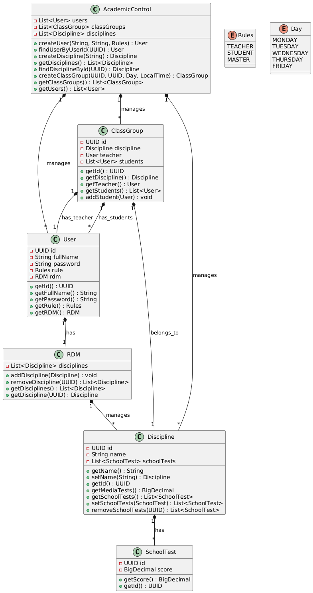

---

# Análise e Implementação do Sistema Acadêmico

## Descrição

Este repositório contém o desenvolvimento de um sistema acadêmico para gerenciamento de usuários, disciplinas, grupos de aula e avaliações. A aplicação tem como objetivo facilitar a administração das informações de uma instituição educacional, incluindo o controle de alunos, professores, turmas e provas.

## Sugestões Pré-Implementação

### 1. Identificação das Entidades do Sistema

Durante a análise do sistema, foram identificadas as seguintes entidades principais:

- **Usuário** (User): Representa os indivíduos envolvidos no sistema (alunos, professores, etc.).
- **Disciplina** (Discipline): Refere-se às disciplinas oferecidas pela instituição.
- **Turma** (ClassGroup): Representa os grupos de aula formados para cada disciplina.
- **Prova** (SchoolTest): Representa as provas aplicadas nas disciplinas.
- **RDM** (RDM - Registro de Disciplina do Módulo): Gerencia a relação entre usuários, disciplinas e as provas associadas a essas disciplinas.

### 2. Características de Cada Entidade

Cada uma das entidades tem as seguintes características:

#### **Usuário** (User)
- **ID**: Identificador único do usuário.
- **Nome Completo**: Nome do usuário.
- **Senha**: Senha de acesso ao sistema.
- **Regra**: Define o papel do usuário no sistema (ex.: aluno, professor).
- **RDM**: Registra as disciplinas do usuário.

#### **Disciplina** (Discipline)
- **Nome**: Nome da disciplina.
- **Avaliações**: Conjunto de provas associadas à disciplina.

#### **Turma** (ClassGroup)
- **ID**: Identificador único da turma.
- **Disciplina**: Disciplina que a turma está oferecendo.
- **Professor**: O professor responsável pela turma.
- **Dia**: O dia da semana em que as aulas da turma ocorrem.
- **Horário**: O horário de início e término das aulas.
- **Alunos**: Lista de alunos inscritos na turma.

#### **Prova** (SchoolTest)
- **ID**: Identificador único da prova.
- **Nota**: Nota obtida pelo aluno na prova.
- **Disciplina**: A disciplina à qual a prova pertence.

#### **RDM** (RDM)
- **ID**: Identificador único do RDM.
- **Disciplinas**: Lista de disciplinas associadas ao RDM.
- **Professores**: Lista de professores que estão associados às disciplinas.

### 3. Diagrama de Relacionamentos Entre as Entidades

O diagrama abaixo ilustra os relacionamentos entre as entidades do sistema:

- **Usuário → Turma**: Um usuário pode ser aluno ou professor de várias turmas.
- **Turma → Disciplina**: Cada turma está associada a uma disciplina.
- **Disciplina → Prova**: Cada disciplina pode ter várias provas associadas.
- **RDM → Disciplina**: O RDM gerencia a associação de disciplinas aos usuários.

### 4. Análise dos Experts para Cada Situação

A análise de especialistas foi realizada para identificar as responsabilidades e garantir a correta implementação do sistema. Os seguintes experts foram atribuídos para cada situação:

- **Usuário**: Especialista na definição de papéis e acesso ao sistema.
- **Disciplina**: Especialista na criação e manutenção das disciplinas.
- **Turma**: Especialista em organização de turmas e distribuição de alunos.
- **Prova**: Especialista na definição e correção de provas.
- **RDM**: Especialista em registrar e gerenciar a relação entre usuários e disciplinas.

### 5. Responsabilidades

Abaixo estão as responsabilidades de cada entidade e especialista no sistema:

- **Usuário**:
    - Criar, editar e remover informações de usuários.
    - Gerenciar papéis e permissões dos usuários (ex.: alunos, professores).

- **Disciplina**:
    - Definir e editar disciplinas.
    - Associar provas às disciplinas.

- **Turma**:
    - Organizar e alocar alunos e professores nas turmas.
    - Definir horários e dias das aulas.

- **Prova**:
    - Criar e corrigir provas.
    - Associar provas às disciplinas.

- **RDM**:
    - Gerenciar o relacionamento entre usuários e disciplinas.
    - Registrar informações sobre as provas realizadas pelos usuários.

---

## Versões do Projeto

### Versão Atual

A versão mais recente do projeto está disponível na branch `main`:

[**Acessar a versão atual**](https://github.com/TarcioDiniz/academic_control_simple)

### Versões Anteriores

O projeto também tem versões anteriores, e você pode acessá-las diretamente por meio das tags. Aqui estão algumas versões anteriores:

- [**Versão 2.0**](https://github.com/TarcioDiniz/academic_control_simple/tree/v2) (Versão atual do projeto)
- [**Versão 1.0**](https://github.com/TarcioDiniz/academic_control_simple/tree/v1) (Versão inicial)

---

## Licença

Este projeto está sob a licença MIT - consulte o arquivo [LICENSE](LICENSE) para mais detalhes.

---